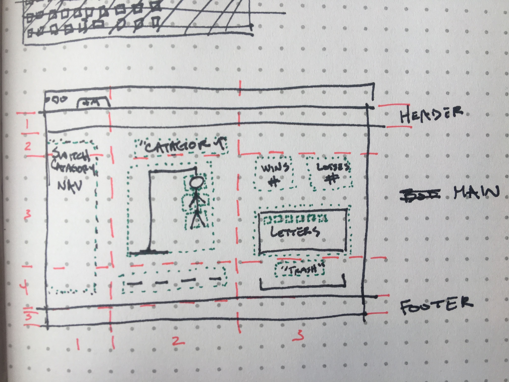
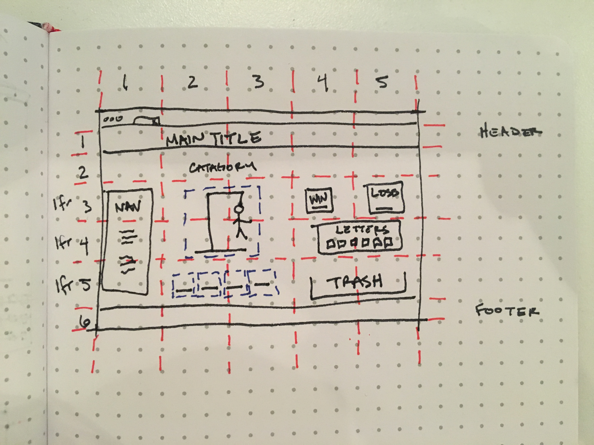

# 01-project-Hangman
Alt-H1 Hangman

## Project Description
Hangman is a game in which player guess letters to spell a word in a given category. Players can only make 5 incorrect guesses befor their man will be hanged. A point woll be awarded to the player who spells the word correctly and the word will be excluded from futer rounds. If a word is not spelled before the player reaches their sixth wrong letter choice, the point will be awarded to the oposing player and the work remains in play for future rounds. After all the words have been correctly spelled, a winner will be determined.

### Find the game here:
https://pedantic-meninsky-8424b4.netlify.com

### View my Trello Board here:
https://trello.com/b/SnkMhZQ2/project-1-game

### Wireframes

#### Initial Wireframe

#### Second Wireframe

### Technologies used:

-CSS
-HTML
-Vanilla Javascript

### In Version Two:

-Give gravity to letters so thay fall in a trash bin when incorrect.
-Have the option to play as one or two player.
-Change two player to use an input from one player and the other spells.